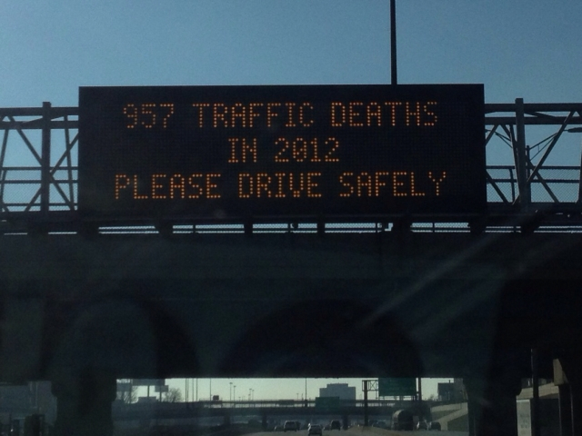
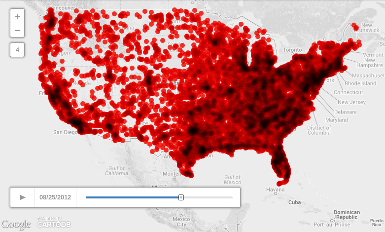

You may have seen a sign like the one pictured above while on the highway in Illinois, displaying how many deaths there have been on the road. The sign above says there had been 957 traffic deaths in 2012. That number is scary, but what does it really mean? Where did they happen and under what conditions? Besides avoiding texting while driving, what else should I be watching out for?

As a non-driver myself, and feeling pressure from family to get my driver's license, I feel all the more sensitive to statistics like this. I don't drive precisely because of the risk of accidents. If we were all driving bouncy bubble cars, I would have gotten my license many years ago. I'm still considering getting my license anyway and I'd feel a lot better if I could pinpoint where the really awful accidents happened.

I want to see a map with positions of the accidents overlaid, and I want to see how that changes over time. I'm using data from the [Fatality Analysis Reporting System](http://www-fars.nhtsa.dot.gov/Main/index.aspx) provided by the [National Highway Traffic Safety Administration](http://www.nhtsa.gov/).



The above screenshot is from an [animated map using 2012 FARS data](http://cdb.io/1cagt7b).

# Get The Data

FARS has data for the years 1975 to 2012 (inclusive). To get year 2012:

```
./get_data_for_year_XXXX.sh 2012
```

This will create a `2012` folder, download a ZIP file from FARS to it, and unzip the DBF files there.

DBF is the [dBASE](http://en.wikipedia.org/wiki/DBase) file format, and it's as ancient as Time itself. There are several Python modules that read it, but I used [dbfpy](http://dbfpy.sourceforge.net/) because it had the best documentation.

# Gimme CSV Please

Let's say you downloaded data for 2012. Here's how you convert the accident list into a CSV file you can open with, well, almost anything:

```
python dbf_to_csv.py 2012/accident.dbf 2012/accident.csv
```

# Trim The Data

Umm, that CSV file is 4.7 megabytes and thirty-three thousand rows. That's a bit unwieldly if we want to visualize it on the web. Let's cut it down so we have just

* The date and time of the accident. Fields: MONTH, DAY, HOUR, MINUTE
* The number of fatalities reported. Field: FATALS
* The geographic location. Fields: LATITUDE, LONGITUD

To trim accident.csv from the previous step into something a little more manageable:

```
python simplify_csv.py 2012/accident.csv 2012/accident_simplified.csv
```

The new file is still thirty three thousand rows but it's about 25% its former size at 1.2 megabytes.

# Do Something With It

Upload this to [CartoDB](http://cartodb.com/visualize) or [Google Fusion Tables](http://www.google.com/drive/apps.html#fusiontables) to map this data and explore.

# People, Not Data

We should not let the numbers go to our heads. After all is said and done, there were still at least 33000 violent and assuredly unexpected deaths of people in 2012. That's like the population of a township just dying tragically in one year. It's mind-boggling. I struggle to comprehend or describe that kind of loss.

Please read Jake Solomon's essay [People, Not Data](https://medium.com/p/47434acb50a8).
